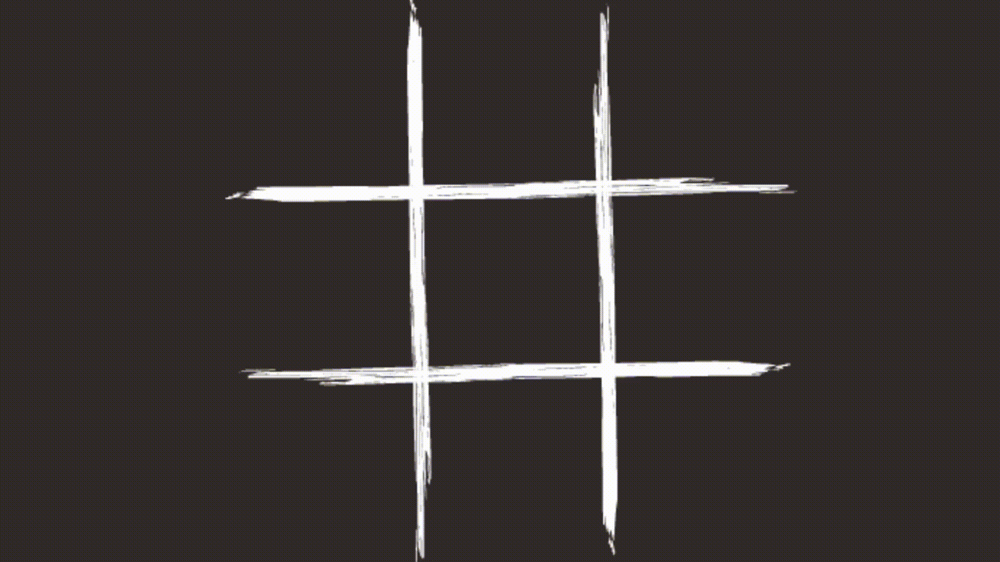
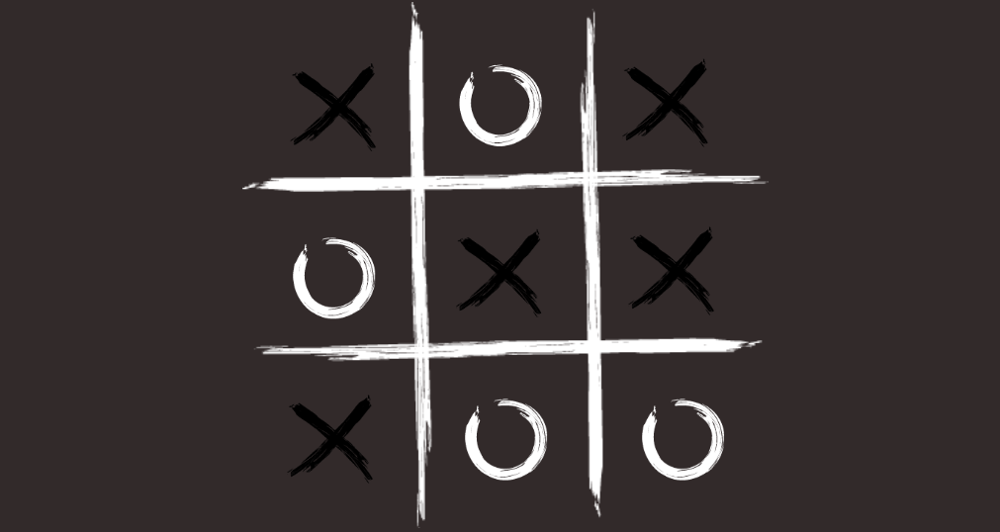
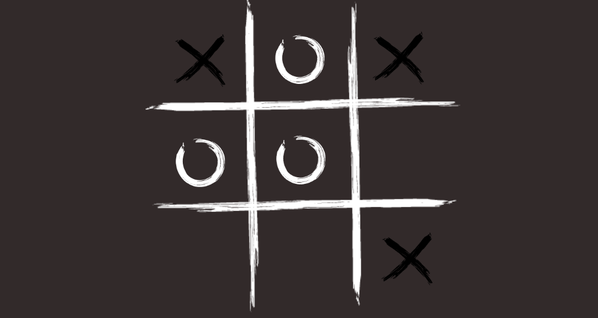

# TicTacToe

---

### Table of Contents

- [Description](#description)
- [How To Play](#how-to-Play)
- [Learned](#learned)
- [Author Info](#author-info)

---

## Description
Game in which two players seek in alternate turns to complete a row, a column, or a diagonal with either three O's or three X's drawn in the spaces of a grid of nine squares.

---

## How To Play
> Press on one of the 9 squares that you want to mark then switch turn with other player and repeat untill one of you win.

---

## Learned 
- Played with operators 

---

## Author Info

- Twitter - [@MarceliKumiers1](https://twitter.com/MarceliKumiers1)
- LinkedIn - [Marceli Kuśmierski](https://www.linkedin.com/in/marceli-ku%C5%9Bmierski-321969165/)

[Back To The Top](#TicTacToe)
